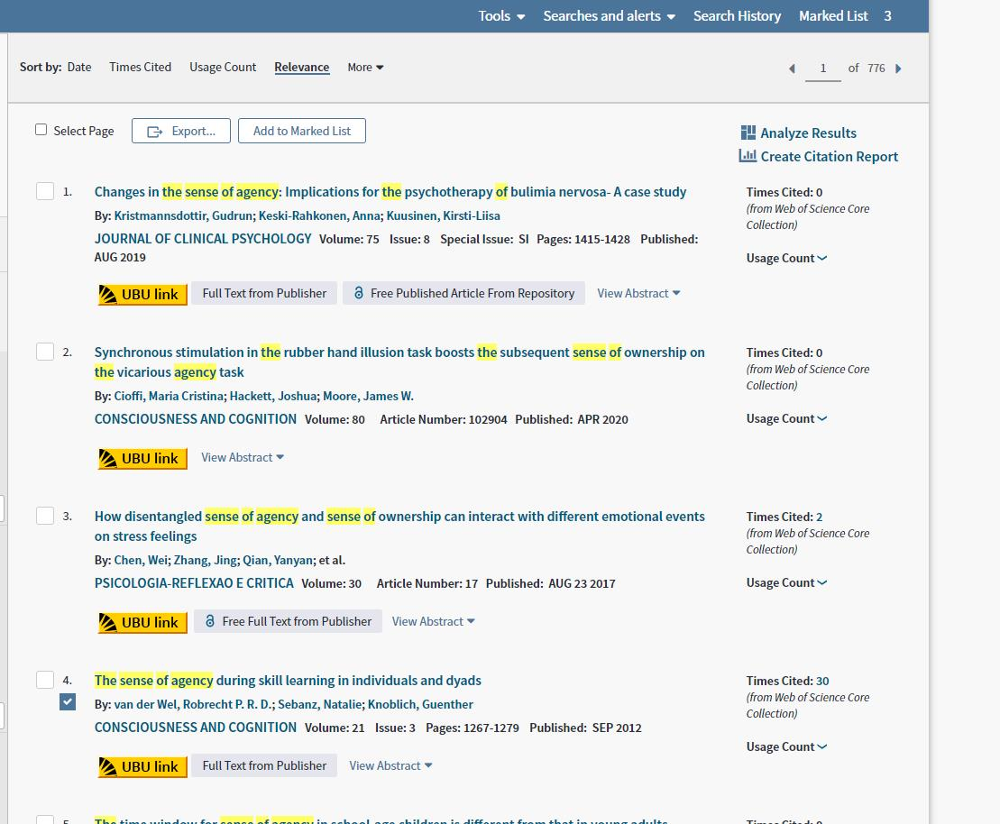
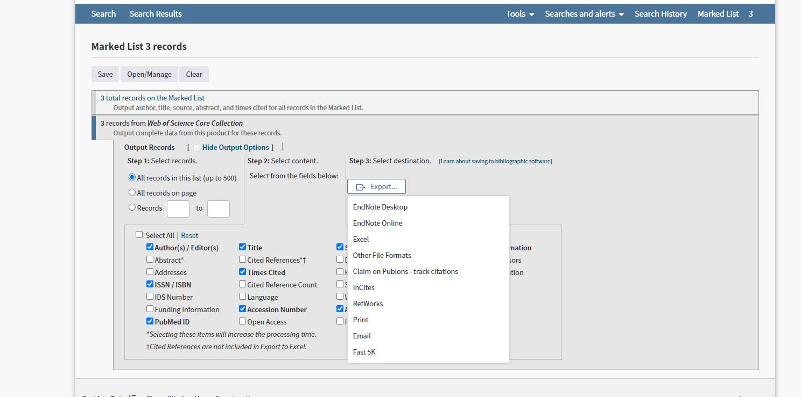
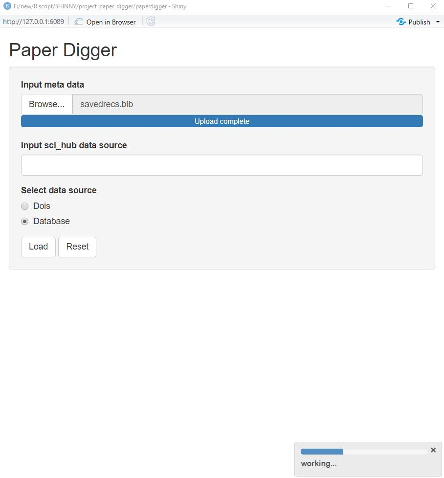
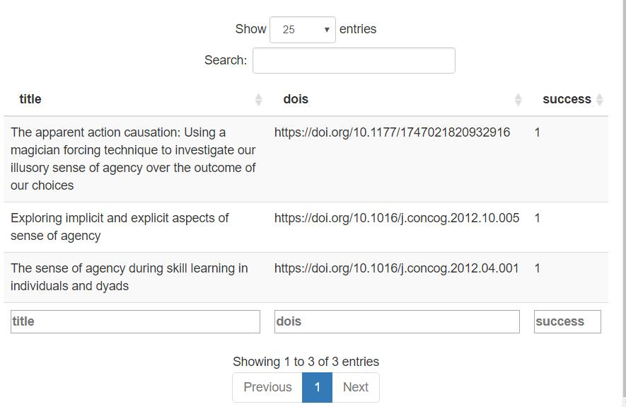

<!-- README.md is generated from README.Rmd. Please edit that file -->

# paperdigger

<!-- badges: start -->

[](https://www.tidyverse.org/lifecycle/#experimental)
<!-- badges: end -->

The goal of paperdigger is to automatically download academic papers
from sci-hub.

## Installation

You can install the package from [GitHub](https://github.com/) with:

``` r
# install.packages("devtools")
devtools::install_github("KiayangQ/paperdigger")
```

## Usage

To call the shinyapp:

``` r
library(paperdigger)
## basic example code
paper_dig()
```

To use the R function:

``` r
library(paperdigger)
## original refers to the source of a bibliographic file, either from a database or from manual collection 
sci_down("ad.bib")
```

## Example

You can download bibliographic data file (e.g. .bib or ris) from
databases like web of science.  You can
add the paper you want to download to MarkList and export the BibTex
file (In the image below, you can select Other File Formats to access
the BibTex format). 

Then call the shiny app and upload the data file,then click “load” to
start downloading. You can see a progress bar at right corner of the
downside.



You file will be stored in a file folder called “paperxxxxx”. You can
find the file folder in the current working directory.

In addition, when the download is finished, you will see a summary table
about how many papers you have successfully downloaded(success = 1).



You can also use sci\_down function in R console.

Simply use these code in R console:

``` r
library(paperdigger)

sci_down(filename)
```

Or if you use self collected dois, please save the file as .txt or .csv
format and make it like this:

``` r
library(paperdigger)

sci_down(filename,"orignial=Dois")
```

and this parameter is also optional in the shiny app).

## Note

Now, this app works well for databases like web of science(.bib),science
direct(.ris),ebsco(.ris),and even .bib files from Mendeley. Please
output the recommended data format within brackets for each database.
However, the database like google scholar is not supported since doi
information is not available.
